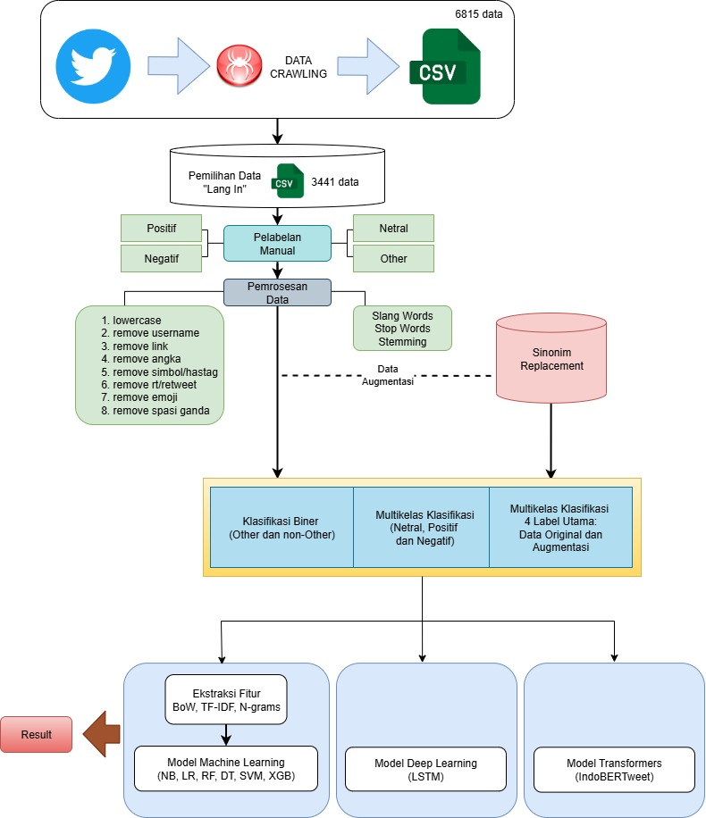
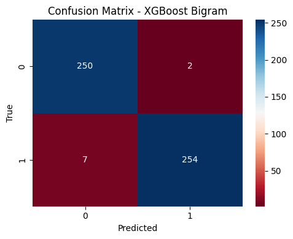
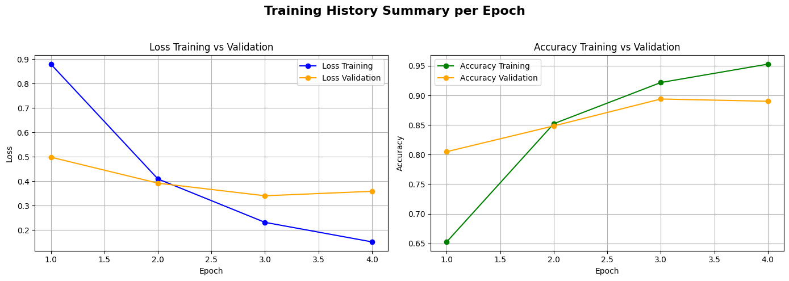
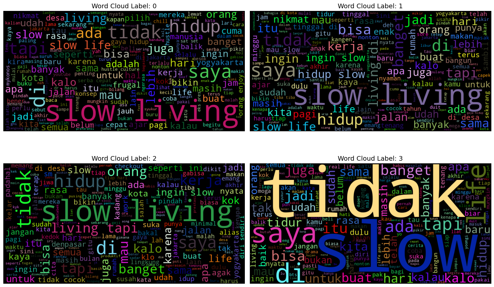
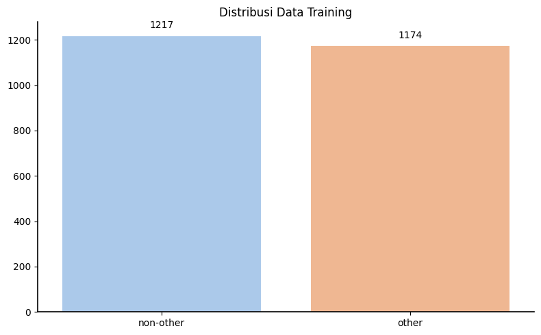
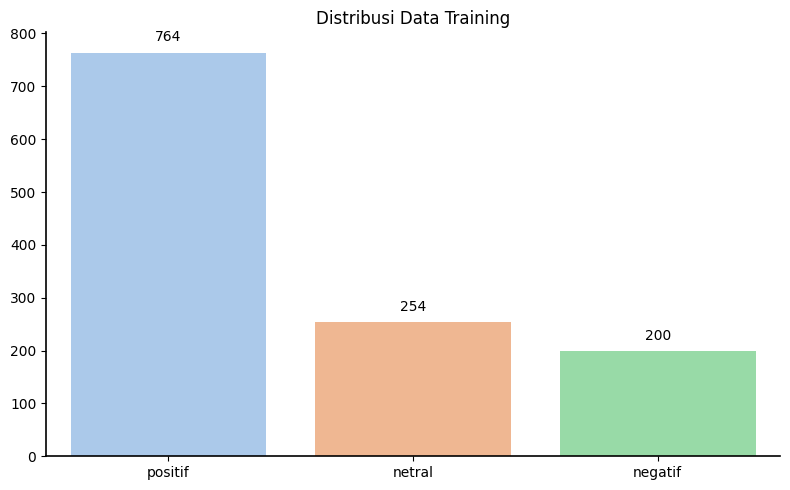
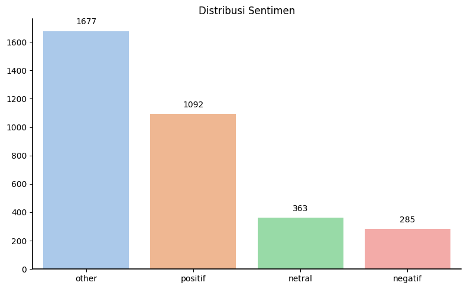
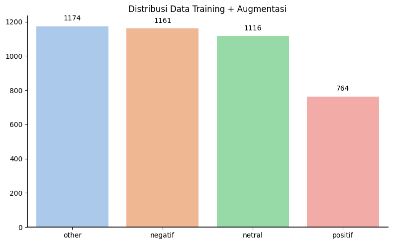

      
    <b>Conceptual Framework</b> of the <i>Slow Life</i> Lifestyle

<h1 align="center">
Sentiment Analysis of the <i>Slow Life</i> Lifestyle on Twitter (X)
</h1>

This study analyzes public sentiment toward the <i>Slow Life</i> lifestyle as expressed on Twitter (X).

---

## 📂 Dataset Access

The datasets used in this study are available through the following links:

### 1️⃣ Raw Dataset  
Contains original tweets collected from Twitter (X) prior to preprocessing and labeling.

🔗 [Download](https://drive.google.com/file/d/1GkX_N8wf8YmQosazKQ1r3ckr1RYxRGw_/view?usp=sharing)

---

### 2️⃣ Preprocessed Dataset  
Contains cleaned and normalized tweets used for feature extraction and modeling.

🔗 [Download](https://drive.google.com/file/d/1zCIipCHY3xvFtgGeFBMLWATXsY96czdi/view?usp=sharing)

---

## 📌 Intro

The rapid growth of social media, particularly Twitter (X), has created a public space for discussions on various social phenomena, including the emerging trend of the <i>Slow Life</i> lifestyle. This concept emphasizes a more mindful, balanced, and meaningful way of Life amid the fast-paced modern culture.

This study aims to analyze public sentiment toward the <i>Slow Life</i> lifestyle as expressed through tweets.

---

## 🎯 Research Objectives

1. To identify public sentiment toward the <i>Slow Life</i> lifestyle.
2. To classify tweets into four categories: Positive, Negative, Neutral, and Others.
3. To compare the performance of various feature extraction methods and models.

---

## 🧠 Methodology Overview

- **Data Source**: Twitter (X)

- **Research Stages**:
  - Data Crawling (January 1, 2020 – January 1, 2025)
  - Manual Labeling (Positive, Negative, Neutral, Others)
  - Preprocessing
  - Feature Extraction (BoW, N-gram, TF-IDF, IndoBERTweet)
  - Modeling & Evaluation

- **Experimental Scenarios**:
  - Binary Classification (Others vs Non-Others)
  - Multi-Class Classification (Positive, Negative, Neutral)
  - Multi-Class (Original vs Augmented Data: Positive, Negative, Neutral, Others)

---

## 🤖 Modeling Approach

To comprehensively evaluate performance, this study compares three modeling approaches:

### 1️⃣ Machine Learning Models
Traditional supervised learning algorithms were implemented using BoW, N-gram, and TF-IDF features:

- **Naive Bayes**
- **Logistic Regression**
- **Decision Tree**
- **Random Forest**
- **Support Vector Machine (SVM)**
- **XGBoost**

These models aim to evaluate how well classical statistical approaches perform in handling sentiment classification tasks with structured feature extraction.

---

### 2️⃣ Deep Learning Model

- **Long Short-Term Memory (LSTM)**

LSTM is employed to capture sequential dependencies within textual data. Unlike traditional machine learning models, LSTM processes text as ordered sequences, allowing contextual learning across word positions.

---

### 3️⃣ Transfer Learning Model

- **IndoBERTweet**

IndoBERTweet is a pre-trained transformer-based language model specifically optimized for Indonesian Twitter data. It is fine-tuned for sentiment classification tasks in this study. This approach leverages contextual embeddings and semantic understanding beyond surface-level lexical features.

---

## 📈 Evaluation Strategy & Example Results

Model performance is evaluated using several quantitative metrics and visual analysis. Below are example outputs for each evaluation method.

---

### 1️⃣ Confusion Matrix

The confusion matrix provides a detailed breakdown of prediction results for each class, allowing identification of misclassification patterns.

     
    <b>Figure 1.</b> Example Confusion Matrix from Biner-Class Classification

The matrix shows how many samples were correctly classified (diagonal values) and how many were misclassified across sentiment categories.

---

### 2️⃣ Classification Report

The classification report summarizes key evaluation metrics:

- Accuracy  
- Precision  
- Recall  
- F1-Score  

| Class | Precision | Recall | F1-Score | Support |
|-------|-----------|--------|----------|---------|
| 0 | 0.71 | 0.65 | 0.68 | 55 |
| 1 | 0.87 | 0.88 | 0.88 | 164 |
| 2 | 0.75 | 0.84 | 0.79 | 43 |
| 3 | 0.98 | 0.97 | 0.98 | 251 |
| **Accuracy** |  |  | **0.90** | 513 |
| **Macro Avg** | 0.83 | 0.84 | 0.83 | 513 |
| **Weighted Avg** | 0.90 | 0.90 | 0.90 | 513 |

This report allows performance comparison per class performance issues. Example Classification Report from Multi-Class Data Augmentation.

---

### 3️⃣ Learning Curve

The learning curve evaluates model generalization by comparing training and validation performance across different dataset sizes.

     
    <b>Figure 3.</b> Example Learning Curve Visualization from Multi-Class Data Augmentation

From this visualization, we can observe:
- Overfitting (large gap between training and validation score)
- Underfitting (both scores low)
- Good generalization (scores converge at high value)

---

## 📊 Experimental Data Distribution

<table>
<tr>
<td align="center">
 
<b>Initial Dataset Distribution</b> 
Overall class distribution.
</td>
</table>

 

<table>
<td align="center">
 
<b>Word Cloud Visualization</b> 
Visualization of the most frequent words appearing in the <i>Slow Life</i> tweet dataset.
</td>
</tr>
</table>

 

<table>
<tr>
<td align="center">
 
<b>Binary Classification</b> 
Training data distribution between <i>Others</i> and <i>Non-Others</i>.  
This experiment aims to separate relevant and irrelevant tweets related to the <i>Slow Life</i> topic.
</td>

<td align="center">
 
<b>Multi-Class</b> 
Training data distribution across <i>Positive</i>, <i>Negative</i>, and <i>Neutral</i> categories, excluding the <i>Others</i> class.
</td>

<td align="center">
 
<b>Multi-Class (Original Data)</b> 
Distribution of <i>Positive</i>, <i>Negative</i>, <i>Neutral</i>, and <i>Others</i> classes  
using the original dataset <i>(imbalanced data)</i>.
</td>

<td align="center">
 
<b>Multi-Class (Data Augmentation)</b> 
Distribution after applying <i>Synonym Replacement</i>  
using the <i>XLM-RoBERTa</i> language model to reduce class imbalance.
</td>
</tr>
</table>

---

## 🔎 Error Analysis of Model Predictions

Below are selected examples of model misclassifications across different experimental scenarios:

| No | Classification Scenario | Sample + True Label | Predicted Label | Analysis |
|----|--------------------------|---------------------|-----------------|----------|
| 1 | **Binary Classification** (Others vs Non-Others) | **Tweet:** @kennyivan wkwkwkwk coba diriset... efek lebaran haji ken slow life dulu…   **True Label:** Non-Other (Positive) | Other | The sample contains the keyword *“slow life”*. However, the model failed to understand the implicit sentiment. Although it recognizes the term, it does not capture the positive contextual meaning related to post-holiday relaxation. |
| 2 | **Multi-Class** (Neutral, Positive, Negative) | **Tweet:** Yo.opo se slow Living iku   **True Label:** Neutral | Negative | This sentence is a question about *slow living*. The model failed to recognize that the phrase indicates a question rather than a complaint or sarcasm. |
| 3 | **Multi-Class** (Neutral, Positive, Negative, Others) | **Tweet:** slow living tidak berlaku untuk yang hidup dalam tekanan dan tuntutan warga sekitar.   **True Label:** Negative | Neutral | The sentence contains clearly negative expressions such as “not applicable,” “pressure,” and “demands.” However, the model interpreted it as a neutral social description. |
| 4 | **Multi-Class** (Neutral, Positive, Negative, Others) | **Tweet:** memang slow living di klaten tidak tergantikan   **True Label:** Positive | Negative | The model misinterpreted the phrase “not replaceable” as negative due to focusing solely on the negation word “not.” This indicates difficulty in understanding implicitly positive expressions formed through negation. |

---
